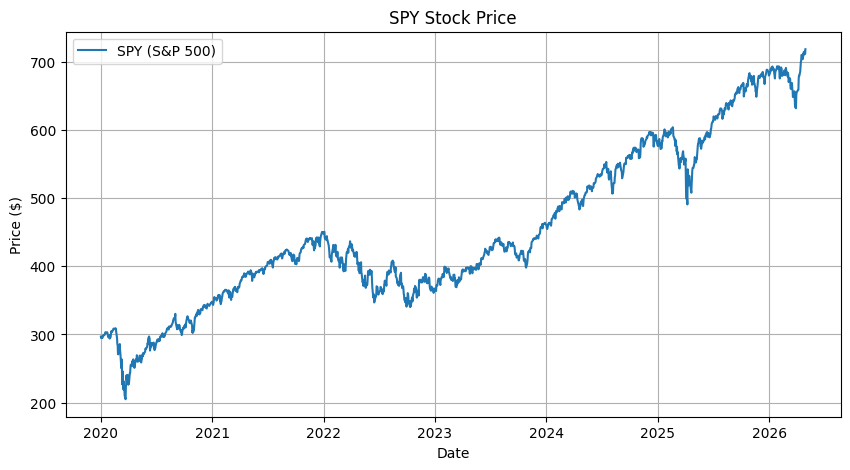
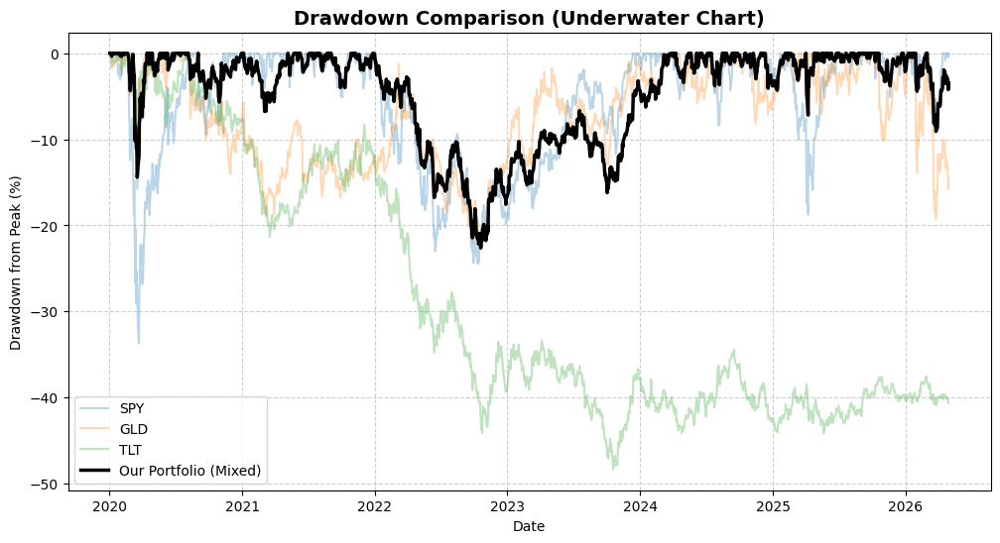
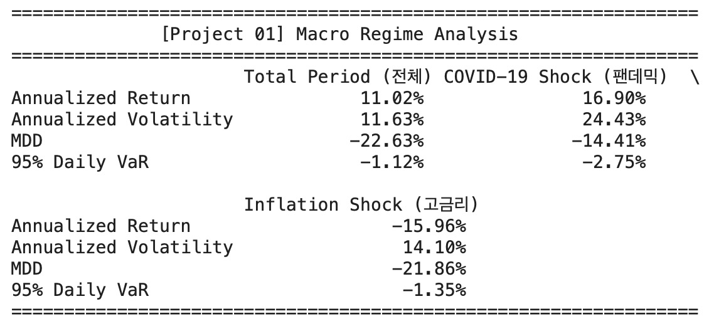
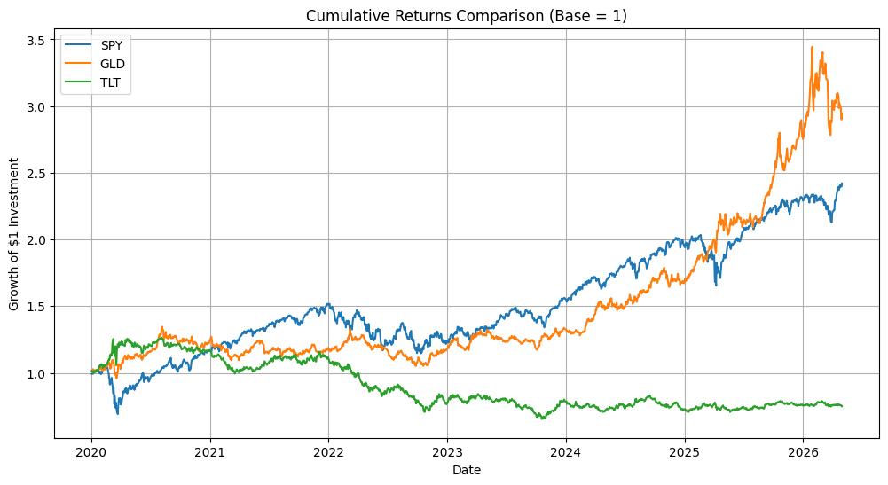
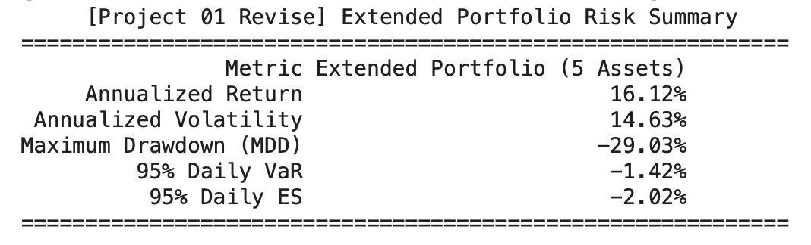
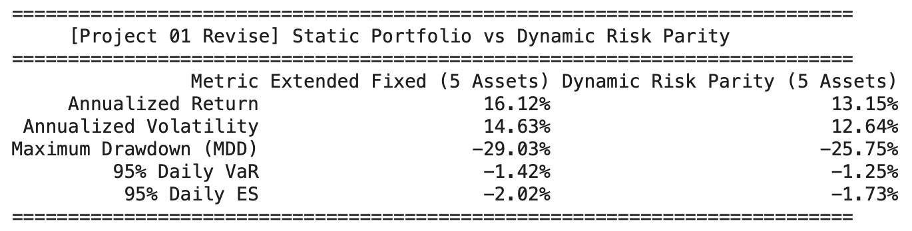
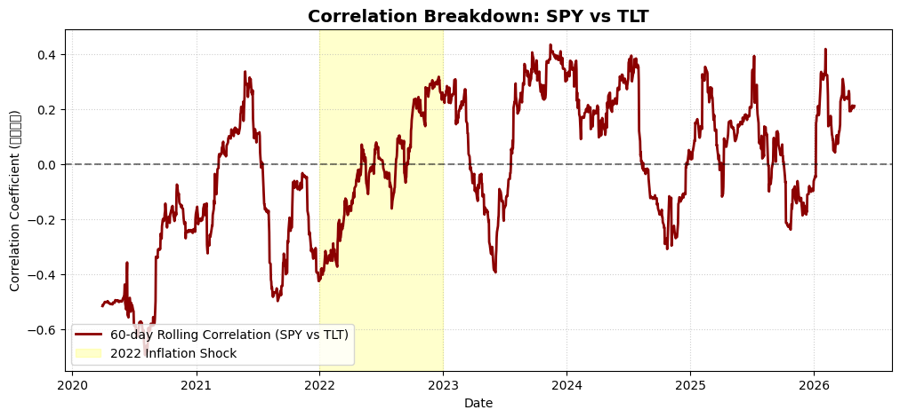
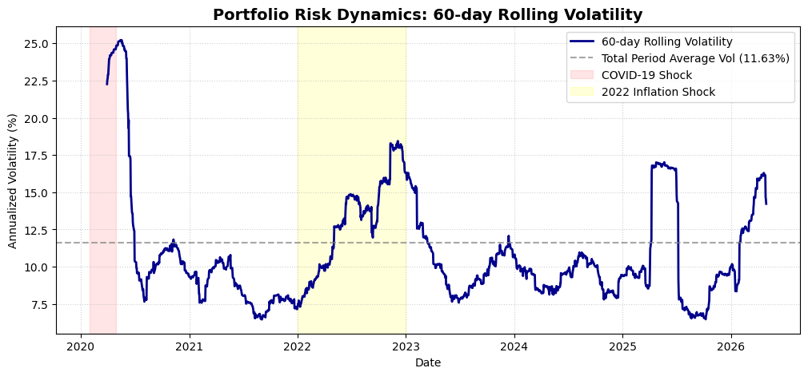

# Multi-Asset Portfolio Stress Testing & Macro Risk Analysis

A quantitative risk management project designed to evaluate the empirical resilience of a traditional diversified multi-asset portfolio under extreme macroeconomic stress regimes. This project goes beyond basic historical backtesting to analyze structural flaws in asset allocation—specifically focusing on volatility clustering, inter-asset correlation breakdowns, and algorithmic risk mitigation.

---

## Research Motivation (Synergy with Factor Alpha Generation)

While actively developing and passing mathematical alpha expressions during the **WorldQuant BRAIN International Quant Championship (IQC) 2026 (Stage 02)**, I heavily focused on extracting statistical anomalies from large-scale corporate fundamental datasets. For instance, I successfully implemented expressions targeting asset mispricing based on multi-day historical Z-scores of balance sheet and income statement dynamics (e.g., formulations capturing intangible asset overvaluation like `-1 * ts_zscore(goodwill / sales, 500)`).

Through this rigorous competitive process, I recognized a critical structural limitation inherent in cross-sectional alpha generation platforms: they operate in macro-level silos. While simulators efficiently generate traditional, aggregated performance metrics—such as the Sharpe Ratio, Turnover, and generic Maximum Drawdown (MDD)—they heavily restrict customized downstream risk modeling and non-linear risk diagnostics under shifting macroeconomic regimes.

To bridge this crucial analytical gap between **Alpha Sourcing** and **Institutional Risk Architecture**, I independently engineered this Python-based multi-asset stress-testing framework. The core objective of this project is to construct an autonomous risk engine capable of ingesting arbitrary tactical strategies or synthetic portfolio returns, subsequently exposing them to historical liquidity crunches and inflationary macro shocks. By computing advanced tail-risk metrics tailored to Basel III standards—specifically **95% Historical Value at Risk (VaR)** and **95% Expected Shortfall (ES)**—this framework serves as a rigorous, independent validation filter that stress-tests the economic boundaries of diversified capital allocation.

---

## Objective
- Synthesize a diversified asset portfolio and evaluate its empirical performance from 2020 to 2026.
- Quantify portfolio tail risk under varying macroeconomic regimes (e.g., liquidity shocks vs. inflationary rate-hike cycles).
- Statistically prove the limitations of Modern Portfolio Theory (MPT) and correlation stability during high-inflation crises.
- Implement an automated Dynamic Risk Parity model to mathematically mitigate tail-risk degradation.

---

## Portfolio Architecture
The framework evaluates three distinct progressive asset allocation strategies:
1. **Baseline Portfolio (3 Assets):** Tactical asset mix focused on core diversification.
   - Equities (Growth): SPY (S&P 500 ETF) — 40%
   - Alternatives (Inflation Hedge): GLD (SPDR Gold Shares) — 30%
   - Fixed Income (Defensive): TLT (iShares 20+ Year Treasury Bond ETF) — 30%
2. **Extended Fixed Portfolio (5 Assets):** Expanded universe to capture idiosyncratic growth and industrial commodities.
   - SPY (30%) / PLTR (10%) / GLD (20%) / SLV (10%) / TLT (30%)
3. **Dynamic Risk Parity Portfolio (5 Assets):** Volatility-adjusted allocations updated daily based on a 60-day rolling realized risk parameter ($\omega_i \propto 1/\sigma_i$).

---

## Methodology & Core Metrics
1. **Annualized Geometric Return:** Captured compounded growth normalized on a 252-day trading year.
2. **Annualized Volatility:** Quantified asset price dispersion applying the square-root-of-time rule ($\sigma \times \sqrt{252}$).
3. **Maximum Drawdown (MDD):** Measured the peak-to-trough decline to evaluate worst-case scenario wealth destruction.
4. **95% Historical Value at Risk (VaR):** Determined the threshold daily loss at a 95% confidence level.
5. **95% Expected Shortfall (ES / Conditional VaR):** Calculated the mean loss conditional on the portfolio breaching its 95% VaR parameter to measure systemic tail-risk depth under Basel III guidelines.

---

## Comprehensive Empirical Results

### 1. Macro Regime Breakdown Summary (Baseline Portfolio)
The table below highlights how the core 3-asset mixed portfolio reacted across distinct historical stress environments:

| Metric | Total Period (2020-2026) | COVID-19 Shock (2020.02 - 2020.04) | Inflation Shock (2022.01 - 2022.12) |
| :--- | :---: | :---: | :---: |
| **Annualized Return** | **11.02%** | 16.90% | -15.96% |
| **Annualized Volatility** | **11.63%** | 24.43% | 13.91% |
| **Maximum Drawdown (MDD)** | **-22.63%** | -14.41% | -21.86% |
| **95% Daily VaR** | **-1.12%** | -2.75% | -1.35% |
| **95% Expected Shortfall (ES)** | **-1.68%** | *Breached* | *Breached* |

*Standalone Asset Vulnerability (Full-Period MDD reference):* SPY: **-33.72%** | GLD: **-22.00%** | TLT: **-48.35%**

### 2. Strategy Optimization Scoreboard (The Core Comparison)
The table below maps the complete progression from the baseline portfolio to asset universe expansion and dynamic algorithmic optimization:

| Portfolio Architecture | Annualized Return | Annualized Volatility | Maximum Drawdown (MDD) | 95% Daily VaR | 95% Daily ES |
| :--- | :---: | :---: | :---: | :---: | :---: |
| **Baseline (3 Assets)** | 11.02% | 11.63% | -22.63% | -1.12% | -1.68% |
| **Extended Fixed (5 Assets)** | 16.12% | 14.63% | -29.03% | -1.42% | -2.02% |
| **Dynamic Risk Parity (5 Assets)** | **13.15%** | **12.64%** | **-25.75%** | **-1.25%** | **-1.73%** |

---

## Advanced Algorithmic & Macro Diagnostics

### 1. The Asset Universe Expansion Trade-off
Incorporating high-beta idiosyncratic growth assets (**PLTR**) and industrial alternatives (**SLV**) amplified the portfolio's compounded return profile by **+5.10%p** relative to the baseline. However, this alpha generation triggered severe downstream tail-risk degradation. The Maximum Drawdown worsened to **-29.03%**, and the **Expected Shortfall (ES)** breached the -2% barrier (**-2.02%**), empirically proving that adding tactical satellite exposure shifts the allocation toward an aggressive regime demanding a tighter liquidity cushion.

### 2. Dynamic Tail-Risk Mitigation via Risk Parity
Transitioning from a rigid, static asset mix to an inverse-volatility dynamic engine successfully insulated the portfolio from catastrophic tail events. The Risk Parity engine actively penalizes high-beta asset clusters during volatility spikes, capturing non-stationary risk shifts. This algorithmic rebalancing successfully recovered the Maximum Drawdown by **+3.28%p** and systematically compressed the **Expected Shortfall (ES) back down to -1.73%**.

### 3. The 2020 Pandemic Shock: Classic Non-Linear Diversification
During the COVID-19 cash crunch, equity markets plummeted (SPY crashed >33%). However, aggressive monetary easing initiated an immediate flight-to-safety surge in long-term Treasuries (TLT) and gold (GLD). The robust **negative rolling correlation** between equities and duration assets successfully mitigated downside risk, strictly containing the baseline portfolio MDD to **-14.41%** despite a massive volatility spike (**24.43%**).

### 4. The 2022 Inflationary Regime: Structural Correlation Breakdown
The asset allocation framework faced its most critical vulnerability during the 2022 monetary tightening cycle. Implementing a **60-day Rolling Correlation** filter mathematically demonstrated that the stock-bond correlation shifted abruptly from a defensive negative territory ($-0.4$ to $-0.6$) to a highly positive regime ($+0.3$). Because both major asset classes fell in tandem due to interest rate spikes, traditional Modern Portfolio Theory (MPT) diversification failed, causing a performance drawdown (**Return: -15.96%, MDD: -21.86%**).

### 5. Risk Non-Stationarity & Volatility Clustering
Applying a **60-day Rolling Volatility** sieve proved that systemic financial risk is non-stationary. The historical returns show distinct risk patterns: short-lived, explosive spikes during sudden liquidity events (2020) versus persistent, elevated risk plateaus during fundamental macroeconomic regime shifts (2022). This highlights why incorporating conditional tail-risk parameters (ES) under Basel III standards is highly superior to static Value at Risk constraints.

---

## Tech Stack & Libraries
- **Language:** Python
- **Data Source:** Yahoo Finance API (`yfinance`)
- **Data Engineering:** `pandas`, `numpy`
- **Visualization:** `matplotlib`

## Repository Structure
- `Project_01_Stress_Testing.ipynb`: Core Jupyter Notebook containing data sourcing, portfolio synthesis, dynamic Risk Parity logic, rolling statistics, and advanced tail-risk metric calculation.
- `README.md`: Institutional-grade research documentation and macro risk diagnostics.

---
## Images
# 1. 3대 개별 자산 취약성(Individual Asset Vulnerability) 

# 2. 1. Macro Regime Breakdown Summary 

# 3. 2. Strategy Optimization Scoreboard 

# 4. The 2022 Inflationary Regime: Structural Correlation Breakdown 

# 5. Risk Dynamics & Volatility Clustering 

-
-
-
